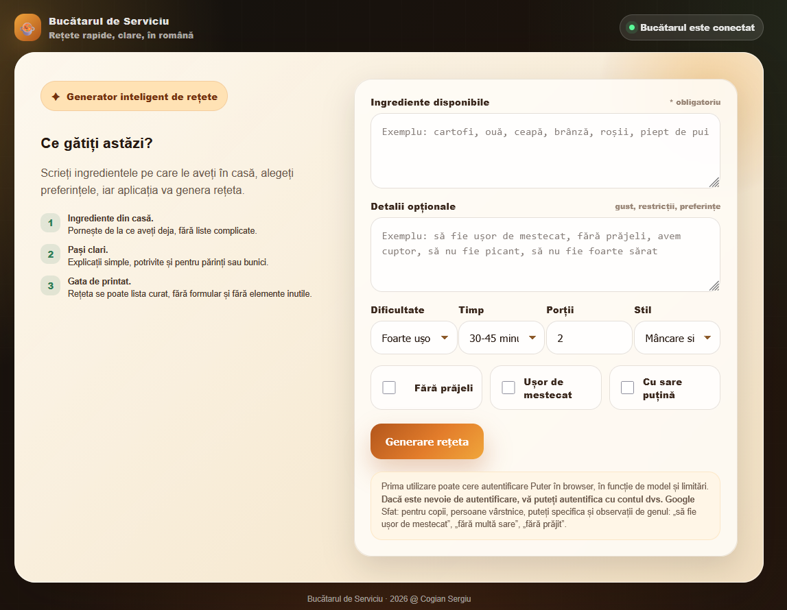

<h1 align="center">🍲 Bucătarul de Serviciu</h1>

<p align="center">
  <strong>Generator inteligent de rețete în limba română</strong><br>
  Rețete clare, rapide și ușor de urmat, pornind de la ingredientele pe care le ai deja în casă.
</p>

<p align="center">
  
  
  
  
</p>

<p align="center">
  <a href="#-preview">Previzualizare</a> •
  <a href="#-funcționalități">Funcționalități</a> •
  <a href="#-instalare">Instalare</a> •
  <a href="#-structură-proiect">Structură</a> •
  <a href="#-instalare">Instalare</a>
</p>

---

## 🖼️ Previzualizare

<p align="center">
  
</p>

---

## ✨ Descriere

**Bucătarul de Serviciu** este o aplicație PHP modernă care generează rețete în limba română pe baza ingredientelor disponibile în casă.

Aplicația este gândită pentru utilizare simplă, inclusiv de către părinți, bunici sau persoane care vor instrucțiuni clare, fără termeni complicați.

Introduceți ingredientele, alegeți preferințele, iar aplicația generează o rețetă completă cu:

- ingrediente principale;
- ingrediente de bază presupuse;
- ustensile necesare;
- pași de preparare;
- timp de pregătire și gătire;
- sfaturi utile;
- atenționări alimentare;
- idee de servire;
- mod de păstrare.

---

## 🚀 Funcționalități

### 🧠 Generare rețete cu AI

Aplicația folosește **Puter.js** în browser pentru generarea rețetelor, fără să fie nevoie să setezi o cheie API în PHP.

```html
<script src="https://js.puter.com/v2/"></script>
```

Modelul folosit în script este:

```js
model: "gpt-5-nano"
```

### 🇷🇴 Răspunsuri în limba română

Promptul este configurat astfel încât rețetele să fie generate **100% în limba română**, cu explicații simple și clare.

### 💾 Salvare rețete pe server

Rețetele generate sunt salvate pe server în fișierul:

```txt
data/recipes.json
```

Nu se salvează în browser, deci istoricul poate fi accesat de pe același server.

### 📚 Istoric rețete

Aplicația include un panou dedicat pentru:

- afișarea rețetelor salvate;
- selectarea unei rețete din istoric;
- redeschiderea unei rețete salvate;
- ștergerea unei rețete;
- golirea completă a istoricului.

### 📴 Mod offline

Rețetele salvate anterior pot fi redeschise din istoricul local de pe server, fără să mai fie nevoie de generare AI.

### 📄 Export PDF

Exportul PDF se face prin funcția de printare a browserului:

```txt
Printare / Salvare ca PDF
```

Aplicația are stiluri speciale pentru print, astfel încât PDF-ul să conțină doar rețeta, fără formular și fără elemente inutile.

### 🎨 Design modern

Interfața este construită cu CSS custom, cu aspect modern:

- fundal dark premium;
- carduri glassmorphism;
- butoane gradient;
- panou de istoric;
- carduri pentru rețetă;
- responsive pentru mobil;
- stil curat pentru printare.

---

## 🧰 Tehnologii folosite

| Tehnologie | Rol |
|---|---|
| PHP 8+ | backend simplu și salvare pe server |
| JavaScript | logică frontend și comunicare cu AI |
| Puter.js | generare rețete AI fără API key în PHP |
| JSON | salvare rețete în `data/recipes.json` |
| HTML5 / CSS3 | interfață modernă și responsive |

---

## 📦 Structură proiect

```txt
Bucatarul_De_Serviciu/
├── index.php
├── data/
│   └── recipes.json
├── screenshot/
│   └── info.png
└── README.md
```

---

## 🛠️ Instalare

### 1. Copiază proiectul pe server

Exemplu pentru Apache pe Ubuntu:

```bash
sudo mkdir -p /var/www/html/bucatar
sudo cp index.php /var/www/html/bucatar/index.php
```

### 2. Creează folderul pentru salvarea rețetelor

```bash
sudo mkdir -p /var/www/html/bucatar/data
```

### 3. Creează fișierul `recipes.json`

```bash
echo "[]" | sudo tee /var/www/html/bucatar/data/recipes.json
```

### 4. Setează permisiunile

Pentru Apache pe Ubuntu:

```bash
sudo chown -R www-data:www-data /var/www/html/bucatar/data
sudo chmod -R 775 /var/www/html/bucatar/data
```

### 5. Accesează aplicația

```txt
http://localhost/bucatar/
```

sau:

```txt
http://IP-SERVER/bucatar/
```

---

## 🔐 Permisiuni importante

Aplicația trebuie să poată scrie în folderul:

```txt
data/
```

Dacă salvarea rețetelor nu funcționează, verifică:

```bash
ls -la /var/www/html/bucatar/data
```

și repară permisiunile:

```bash
sudo chown -R www-data:www-data /var/www/html/bucatar/data
sudo chmod -R 775 /var/www/html/bucatar/data
```

---

## 🧪 API intern

Fișierul `index.php` include și un mic API intern pentru salvare/citire rețete.

| Endpoint | Metodă | Rol |
|---|---:|---|
| `?api=list` | GET | listează rețetele salvate |
| `?api=save` | POST | salvează o rețetă |
| `?api=delete` | POST | șterge o rețetă după ID |
| `?api=clear` | POST | golește istoricul |

Exemplu de fișier salvat:

```json
[
  {
    "id": "reteta_20260602_120000_ab12cd34",
    "title": "Cartofi cu ouă și brânză",
    "description": "O rețetă simplă și rapidă.",
    "createdAt": "2026-06-02T12:00:00+03:00",
    "source": "generată",
    "recipe": {}
  }
]
```

---

## 🧾 Export PDF

Pentru export PDF:

1. deschide o rețetă;
2. apasă **Exportare PDF**;
3. în fereastra de print a browserului alege **Save as PDF** / **Salvare ca PDF**.

---

## 🖥️ Compatibilitate

Testat pentru:

- Apache + PHP 8+
- Linux / Ubuntu
- Chrome / Chromium
- Firefox
- Edge

---

## ⚠️ Observații

Prima utilizare a funcției AI poate cere autentificare Puter în browser, în funcție de model și limitări.

Aplicația nu este un sistem medical sau nutrițional. Rețetele generate trebuie verificate înainte de utilizare, mai ales în cazul alergiilor, dietelor stricte sau problemelor alimentare.

---

## 🌈 Personalizare rapidă

Culorile principale sunt definite în `:root`:

```css
:root {
    --bg: #0f1210;
    --accent: #b3561c;
    --accent2: #f0a63b;
    --accent3: #2f7d57;
}
```

Poți schimba rapid atmosfera aplicației modificând aceste variabile.

---

## 🧹 Curățare istoric

Istoricul poate fi golit direct din interfață, cu butonul:

```txt
Golire istoric
```

Sau manual, din server:

```bash
echo "[]" | sudo tee /var/www/html/bucatar/data/recipes.json
```

---

## 🗺️ Roadmap

- [x] Generare rețete cu AI
- [x] Interfață modernă
- [x] Salvare rețete pe server
- [x] Istoric rețete
- [x] Mod offline pentru rețete salvate
- [x] Export PDF
- [ ] Căutare în rețetele salvate
- [ ] Categorii pentru rețete
- [ ] Favorite
- [ ] Import / export complet JSON
- [ ] Protejare istoric cu parolă

---

## 🤝 Contribuții

Pull request-urile sunt binevenite.  
Poți propune îmbunătățiri pentru design, funcționalități sau optimizare.

---

## 📄 Licență

Acest proiect poate fi folosit și modificat liber pentru uz personal sau educațional.

---

<p align="center">
  <strong>🍲 Bucătarul de Serviciu</strong><br>
  Rețete clare, rapide și salvate pe server.
</p>

<p align="center">
  Creat cu ❤️ în România
</p>
